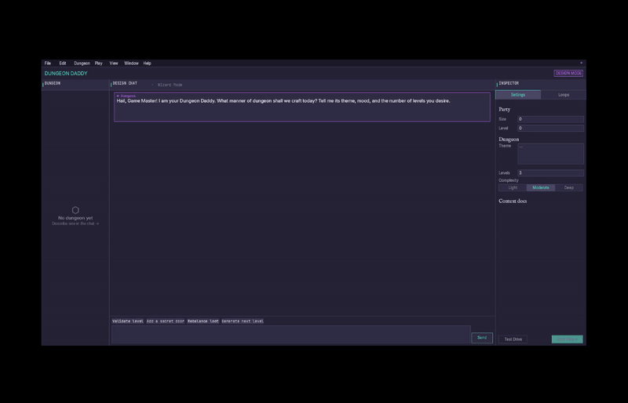
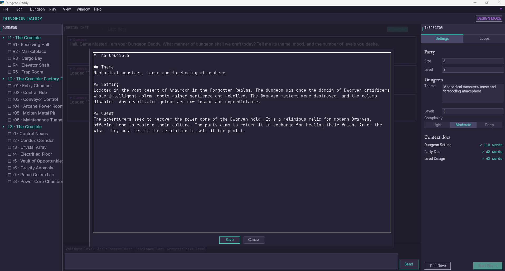
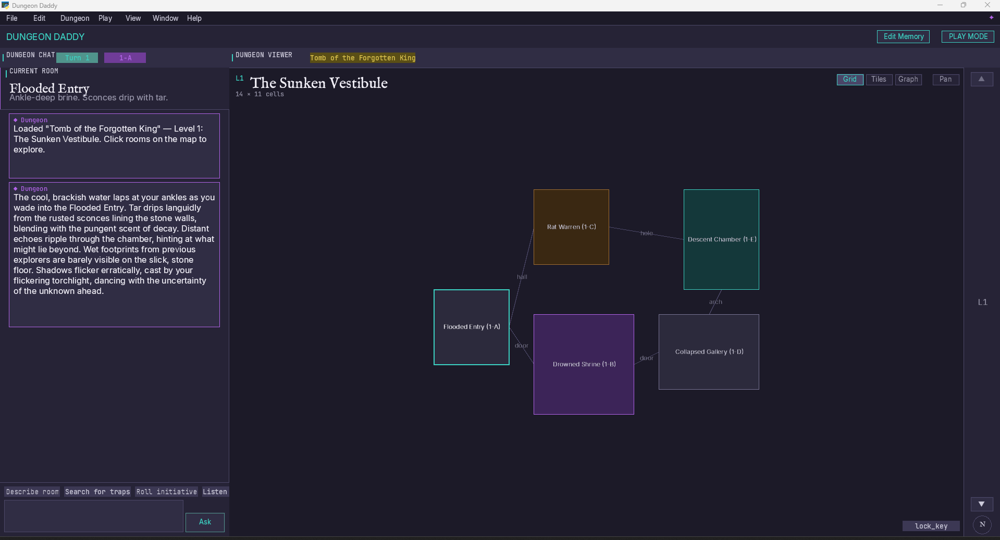

# Dungeon Daddy

[](https://github.com/ghostpencil/dungeon-daddy/actions/workflows/test.yml)

**Dungeon Daddy is two things at once.**

**As a product** — an AI-powered desktop assistant for tabletop game masters. It helps you design multi-level dungeons through conversation, then runs them live with an AI Dungeon Master during play.

**As an experiment** — a reference project for learning how to build real software with an agentic AI coding assistant (Claude Code). Every architectural decision, spec file, test strategy, and workflow pattern in this repo was developed as part of that experiment, and is meant to be read and learned from — not just run.

If you are here to **use the app**, start at [Installation](#installation).
If you are here to **learn from the project**, start at [The Experiment](#the-experiment).

## Demo



---

## Who this is for

Dungeon Daddy may be useful if you are:

- a tabletop game master interested in AI-assisted dungeon design
- a Python developer interested in desktop applications with Arcade
- an engineer exploring Claude Code, context engineering, TDD, UI smoke testing, and AI-assisted SDLC workflows

---

## Features

### Design Mode



- **AI dungeon wizard** — conversational setup collects theme, party, number of levels, and narrative goals
- **Level-by-level generation** — each level is generated immediately and shown in the tree as the wizard progresses
- **Loop pattern library** — 9 structural patterns from dungeon design theory (Lock & Key, Gambit, Foreshadowing, True Fork, Pursuit, Secret Shortcut, Hub & Spoke, Branch & Bottleneck, Shortcut Back)
- **Loop editor** — assign rooms to path A / path B, set sub-loops, visualise arcs on the map
- **Design chat** — free-form conversation with an AI design assistant at any point
- **Dungeon validation** — structural checks with auto-fix for common issues
- **Save / Load / New** — dungeons persist as human-readable JSON

### Play Mode



- **Three map views** — Grid, Tiles, and Graph renderers; pannable viewport
- **AI Dungeon Master** — live narration per room powered by GPT-4o, with full conversation history
- **Room memory** — `/remember <event>` appends dated notes to per-level markdown files; the DM references them on revisit
- **Auto-remember** — the DM tags significant events with `[REMEMBER: ...]`, which are silently written to memory and stripped from chat
- **Loop guidance** — activate a loop from the toggle strip; the DM receives the loop's narrative structure as context
- **Quick chips** — one-click prompts for common GM actions (Describe room, Search for traps, Roll initiative, Listen)

---

## Requirements

- Windows 10/11 (Win32 APIs are used for window management and UI automation)
- Python 3.12+
- [OpenAI API key](https://platform.openai.com/api-keys) (GPT-4o)

---

## Installation

```bash
git clone https://github.com/ghostpencil/dungeon-daddy.git
cd dungeon-daddy
python -m venv .venv
.venv\Scripts\activate
pip install -r requirements.txt
```

Copy the environment template and add your API key:

```bash
copy .env.example .env
# edit .env and set OPENAI_API_KEY=sk-...
```

```bash
python -m dungeon_daddy
```

A sample dungeon (*Tomb of the Forgotten King*) loads automatically on first launch if no saved dungeons exist.

---

## The Experiment

This project was built to answer a practical question: **what does it actually take to ship real software using an agentic AI coding assistant?**

Not a tutorial. Not a toy. A real desktop application, built from scratch, with a real tech stack, real tests, and real failures along the way.

### What we learned

The breakthroughs did not come from better prompts. They came from building a better workflow:

| Problem | Solution |
|---|---|
| AI wandered through the codebase | `CLAUDE.md` + `spec/PROJECT_INDEX.md` control what context loads and when |
| Validation was ad hoc | A reusable `UITestHarness` and smoke test layer became part of every phase |
| Sessions bloated and slowed down | Session reset discipline: one task per context window, state persisted to files |
| AI reversed earlier decisions | Design decisions, working patterns, and corrections written to spec files the agent can re-read |

### How the project is structured for learning

```
CLAUDE.md                  # Agent instructions — read this first
spec/
  PROJECT_INDEX.md         # Phase tracker and spec loading guide
  ARCHITECTURE.md          # Module boundaries and state ownership
  IMPLEMENTATION_PHASES.md # What was built, in what order, and why
  TESTING.md               # TDD strategy and UI test approach
  FEATURES.md              # Acceptance criteria per feature
  ...                      # One spec file per concern
tools/
  ui_harness.py            # Reusable UI test harness (app lifecycle)
  smoke_test_phase*.py     # End-to-end smoke tests per phase
.claude/commands/          # Custom slash commands (skills)
dev_diary/                 # Personal notes from the build — what broke, what worked, and why
```

The `spec/` folder is not just documentation — it is the structured context that the AI coding agent reads before each task. The naming conventions, loading rules, and phase discipline are all deliberate design decisions you can adapt for your own projects.

### The workflow that worked

```
PLAN   → write feature spec, register phase in PROJECT_INDEX.md
BUILD  → TDD skill: plan tests → write failing tests → pass → refactor → verify UI
VALIDATE & PERSIST → run smoke test, update project state, clear session
```

Each phase is small enough to complete in one context window. Each context window ends with state written to files, so the next session starts clean with full context.

### Learning resources

**Dev diary** — personal notes written throughout the build covering what broke, what worked, and why. Start with [the first entry](dev_diary/2026-05-01-project-beginnings.md) if you want the ground-level experience rather than the polished architecture. It is the closest thing in the repo to the raw field notes behind the workflow.

**Presentation** — [Evolution of AI Coding](presentation/Evolution-of-AI-Coding.pdf) — the full slide deck on the patterns and workflow developed during this project.

---

## Architecture

| Layer | Technology |
|---|---|
| GUI / rendering | [Arcade](https://api.arcade.academy/) 3.x |
| Data models | [Pydantic](https://docs.pydantic.dev/) v2 |
| LLM providers | OpenAI `gpt-4o` (primary), Anthropic (fallback) |
| Persistence | JSON via `platformdirs` user data directory |
| Python | 3.12+ |

---

## Development

Install dev dependencies:

```bash
pip install -r requirements-dev.txt
```

Run the test suite:

```bash
pytest
```

The core pytest suite currently includes 745 tests. No real API calls are made during routine test runs — all LLM providers are dependency-injected and mocked.

The project also includes end-to-end UI smoke tests in `tools/smoke_test_phase*.py`, supported by the reusable `tools/ui_harness.py` test harness.

---

## AI Tooling

This project was built with [Claude Code](https://claude.ai/code) using two external tools. They are not required to run the app or tests, but are needed to replicate the AI-driven development and smoke test workflow.

The repo also includes project-specific Claude command files in `.claude/commands/`. These were not generic skills added upfront; they were created or refined in response to real failure modes encountered during the build.

**TDD skill** — guides Claude through a red-green-refactor loop before writing any new tests or features.
Install from [mattpocock/skills](https://github.com/mattpocock/skills/blob/main/skills/engineering/tdd/SKILL.md).

**computer-use-mcp** — MCP server that lets Claude take screenshots and interact with the running app during UI smoke tests (Strategy B).
Install from [domdomegg/computer-use-mcp](https://github.com/domdomegg/computer-use-mcp).

---

## Status

Active development. Core design and play loops are complete through Phase 18. Windows-only; a Linux/WSL2 platform backend is planned.

---

## Contributing

This project is primarily a learning reference for my development team. I'm not accepting external contributions at this stage — we need time to absorb the patterns before opening things up.

Feel free to fork it, experiment, and adapt the workflow for your own projects. If you spot a bug or have a question, open an issue and I'll take a look.

---

## License

[MIT](LICENSE)
